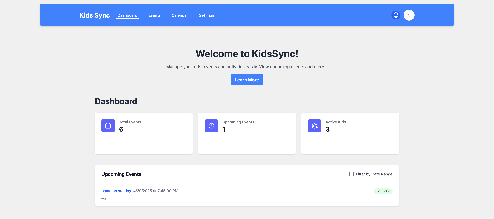

# Kids Sync App

A Spring Boot application for managing kids' activities and schedules with email and WhatsApp integration.

## Features

- User authentication with JWT
- Event management with recurrence support
- Date range filtering for events
- Configurable reminder windows with exponential scheduling
- Smart reminder system with multiple notification points
- Automated reminders via Email and WhatsApp
- MongoDB integration for data persistence
- Docker support for easy deployment

## Tech Stack

- Java 17
- Spring Boot 3.2.3
- Spring Security with JWT
- Spring Mail for email notifications
- MongoDB
- Docker
- Maven
- Next.js 15.2.4 (Frontend)


## Screenshots



## Prerequisites

- Java 17 or higher
- Maven
- Docker and Docker Compose
- MongoDB (provided via Docker)
- Gmail account with App Password (for email notifications)
- Node.js 18+ (for frontend development)

## Getting Started

### Environment Setup

1. Clone the repository:
   ```bash
   git clone https://github.com/arrayindex/kids-sync-app.git
   cd kids-sync-app
   ```

2. Create a `.env` file in the root directory:
   ```bash
   cp .env.example .env
   ```

3. Update the `.env` file with your configuration:
   ```
   MONGODB_URI=mongodb://localhost:27017/kids_sync
   JWT_SECRET=your_jwt_secret_here
   GMAIL_USERNAME=your-email@gmail.com
   GMAIL_APP_PASSWORD=your-app-password
   ```

   **Important:** The JWT_SECRET is a critical security component. Make sure to:
   - Use a strong, random string (at least 32 characters)
   - Never commit this value to version control
   - Keep it consistent across all environments
   - For production, use a secure secret management solution

4. Generate a Gmail App Password:
   - Go to your Google Account settings: https://myaccount.google.com/
   - Navigate to Security
   - Enable 2-Step Verification if it's not already enabled
   - Go to "App passwords" (under 2-Step Verification)
   - Select "Mail" as the app and "Other" as the device
   - Enter a name for the app password (e.g., "KidSync App")
   - Click "Generate"
   - Copy the generated password and use it as the `GMAIL_APP_PASSWORD` in your `.env` file

### Running the Application

1. Start MongoDB using Docker:
   ```bash
   docker-compose up -d
   ```

2. Build and run the backend:
   ```bash
   cd backend
   ./mvnw spring-boot:run
   ```

3. Run the frontend:
   ```bash
   cd frontend
   npm install
   npm run dev
   ```

The backend will be available at `http://localhost:8080` and the frontend at `http://localhost:3000`

## API Documentation

### Authentication Endpoints

#### Register User
```
POST /api/auth/register
Content-Type: application/json

{
    "email": "user@example.com",
    "password": "password123",
    "whatsappNumber": "+1234567890"
}
```

#### Login
```
POST /api/auth/login
Content-Type: application/json

{
    "email": "user@example.com",
    "password": "password123"
}
```

### Event Endpoints

All event endpoints require JWT authentication. Include the token in the Authorization header:
```
Authorization: Bearer <your_jwt_token>
```

#### Create Event
```
POST /api/events
Content-Type: application/json

{
    "name": "Event Name",
    "dateTime": "2024-03-25T10:00:00",
    "notes": "Event notes",
    "recurrence": "NONE" // Options: NONE, DAILY, WEEKLY, MONTHLY
}
```

#### Get All Events
```
GET /api/events
```

#### Get Event by ID
```
GET /api/events/{event_id}
```

#### Update Event
```
PUT /api/events/{event_id}
Content-Type: application/json

{
    "name": "Updated Event",
    "dateTime": "2024-03-25T11:00:00",
    "notes": "Updated notes",
    "recurrence": "WEEKLY",
    "recurrenceEndDate": "2024-04-25T11:00:00"
}
```

#### Delete Event
```
DELETE /api/events/{event_id}
```

#### Get Upcoming Events
```
GET /api/events/upcoming
```

#### Get Events by Date Range
```
GET /api/events/range?start=2024-03-25T00:00:00&end=2024-04-26T00:00:00
```

### Test Email Endpoint

```
POST /api/test/email
Content-Type: application/json

{
    "email": "recipient@example.com"
}
```

### Reminder System

The application now supports a configurable reminder system with the following features:

- Multiple reminder windows: 24 hours, 12 hours, 6 hours, 1 hour, and 5 minutes before events
- Smart scheduling that prevents duplicate reminders
- Automatic cleanup of passed events
- Configurable reminder settings per user
- Support for both email and WhatsApp notifications

#### Reminder Windows

The system automatically sends reminders at the following intervals before an event:
- 24 hours before
- 12 hours before
- 6 hours before
- 1 hour before
- 5 minutes before

Each reminder window is tracked independently to ensure no duplicate notifications are sent.

## Development

### Project Structure
```
backend/
├── src/
│   ├── main/
│   │   ├── java/
│   │   │   └── com/arrayindex/kids_sync_app/
│   │   │       ├── config/         # Security, JWT, and Mail configuration
│   │   │       ├── controller/     # REST controllers
│   │   │       ├── model/          # Data models
│   │   │       ├── repository/     # MongoDB repositories
│   │   │       ├── service/        # Business logic
│   │   │       └── KidsyncApplication.java
│   │   └── resources/
│   │       └── application.yml     # Application configuration
│   └── test/                       # Test files
├── pom.xml                         # Maven dependencies
└── .env                           # Environment variables

frontend/
├── app/
│   ├── components/                 # Reusable UI components
│   ├── services/                   # API services
│   ├── page.tsx                    # Dashboard page
│   ├── calendar/                   # Calendar page
│   ├── events/                     # Events page
│   └── settings/                   # Settings page
├── public/                         # Static assets
└── package.json                    # NPM dependencies
```

### Running Tests
```bash
./mvnw test
```

## Contributing

1. Fork the repository
2. Create your feature branch (`git checkout -b feature/amazing-feature`)
3. Commit your changes (`git commit -m 'Add some amazing feature'`)
4. Push to the branch (`git push origin feature/amazing-feature`)
5. Open a Pull Request

## License

This project is licensed under the MIT License - see the LICENSE file for details.

## Contact

Anurag Saxena - [@arrayindex-io](https://github.com/arrayindex-io)

Project Link: [https://github.com/arrayindex/kids-sync-app](https://github.com/arrayindex-io/kids-sync-app) 